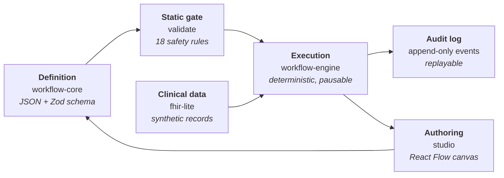

# Clinical Flow Engine

**Author, version, simulate and execute healthcare care pathways as declarative data — not as hardcoded EHR logic.**

[](https://github.com/Vimu-Kale/clinical-flow-engine/actions/workflows/ci.yml)
[](LICENSE)

> ⚠️ **Not a medical device.** This is a reference implementation built on synthetic data. It contains no PHI, connects to no live EHR, and makes no clinical decision support claims.

---

## The problem

Clinical workflows — sepsis screening, prior authorization, referral triage, discharge planning, chronic-care follow-up — are today written as **imperative code buried inside EHRs and point solutions**. That has four expensive consequences:

| Consequence | What it costs |
|---|---|
| Every protocol change is an engineering ticket | Weeks of lead time, a release cycle, regression risk |
| The people who *own* the logic can't read it | Nurses, care managers and quality leads review pseudocode, not the real thing |
| There is no safe rehearsal | Changes reach production against real patients with no dry-run |
| Audit evidence is reconstructed after the fact | Compliance archaeology through application logs |

## The approach

Treat a care pathway as **versioned, testable, executable data**:



A pathway is a JSON file. It passes a static gate before it can run. The engine interprets it one node at a time against a patient record and appends every step to an immutable log. The studio is a thin authoring and simulation layer over exactly the same packages — there is no second implementation.

---

## Quick start

```bash
git clone https://github.com/Vimu-Kale/clinical-flow-engine.git
cd clinical-flow-engine
npm install
```

Run the studio:

```bash
npm run dev
```

Then open <http://localhost:5173>, pick **Adult Sepsis Screening**, choose **Marcus Webb** and press **Start** → **Run**. The pathway pauses on the attending-physician task; complete it and it finishes as `escalated` with a 25-event audit trail.

Run the same checks CI runs:

```bash
npm run verify
```

| Script | What it does |
|---|---|
| `npm run dev` | Studio on port 5173 |
| `npm run build` | Production build of the studio |
| `npm run typecheck` | `tsc --noEmit` across every package |
| `npm run validate:pathways` | Static safety gate over `pathways/*.json` |
| `npm test` | Vitest suite |
| `npm run coverage` | Tests with the coverage thresholds enforced |
| `npm run verify` | typecheck + gate + tests, in that order |

Requires Node ≥ 20.11.

---

## Repository layout

```
packages/
  expression/        Sandboxed expression language (lexer → parser → evaluator)
  workflow-core/     Pathway schema, graph utilities, static validation
  workflow-engine/   Deterministic, pausable interpreter + audit log
  fhir-lite/         FHIR-shaped synthetic records and an in-memory store
apps/
  studio/            React Flow authoring canvas and simulation harness
pathways/            Four production-shaped sample pathways (JSON)
scripts/             The CI validation gate
tests/               98 tests across all four packages
```

---

## The four layers

### 1. Definition — `packages/workflow-core`

A pathway is a graph of typed nodes validated by a Zod schema. Nine node kinds:

| Kind | Purpose |
|---|---|
| `trigger` | Where the pathway starts. Exactly one per pathway, with an optional start filter. |
| `clinical-data` | Reads the record into a named variable. |
| `decision` | Branches on guard expressions, evaluated top to bottom; first match wins. |
| `task` | Human step. **Pauses** the instance until someone completes it. |
| `automation` | Machine step: order a panel, send a message, write back. |
| `timer` | Waits a fixed duration. Also what makes a monitoring loop safe. |
| `escalation` | Raises to a role with a severity and a reason. |
| `subworkflow` | Invokes another published pathway. |
| `terminal` | Ends the instance with a recorded outcome. |

Full field reference: [`docs/node-reference.md`](docs/node-reference.md).

### 2. Static gate — `validateWorkflow()`

Every pathway must pass before it can run — the engine **refuses to construct** against a definition with errors. The rules:

- Exactly one trigger; no incoming edges to it
- Unique node and edge ids; every edge endpoint exists
- No dead ends; terminals have no outgoing edges
- Only a decision may branch (`AMBIGUOUS_ROUTE`)
- Every declared branch is connected, and every edge names a branch the decision declares
- At least one terminal is reachable from the trigger
- **Every loop contains a timer** (`UNGUARDED_LOOP`) — a cycle that can spin without waiting is rejected
- Every guard parses, calls a known function, and passes the right number of arguments
- **Every variable a guard reads is set on *every* path that reaches it**

That last rule is a proper must-analysis over the graph — optimistic initialisation, intersection at merge points, iterated to a fixed point. A variable assigned on only one arm of a diamond is an error, not a runtime surprise:

```
Expression reads "score", which is not guaranteed to be set on every path
that reaches this node. Available here: patient, lactate.
```

### 3. Execution — `packages/workflow-engine`

Two properties matter more than anything else:

**Deterministic.** The only impure input is an injected clock. Same definition + same record + same clock ⇒ byte-identical event log, enforced by a snapshot test.

**Pausable.** Real pathways wait on a lab, a nurse, or forty-eight hours. An instance is a plain serialisable value — store it, reload it, resume it. No process stays alive.

```ts
const engine = new WorkflowEngine(definition, { store, clock });

let instance = engine.run({ patientId: 'patient-sepsis-positive' });
// → status: 'waiting', paused on the attending-physician task

instance = engine.completeTask(instance, { documented: true });
instance = engine.advance(instance);
// → status: 'completed', outcome: 'escalated'
```

Every step appends to `instance.events`, which is both the audit trail and the replay mechanism.

### 4. Authoring — `apps/studio`

React Flow canvas with typed nodes, a property inspector, live validation surfaced on the canvas, and a simulation panel that steps the real engine against a synthetic patient — highlighting the active node and building the trace as it goes. Import/export JSON so a pathway is reviewable in an ordinary pull request.

A decision node renders **one source handle per branch**, so an edge physically cannot attach to a branch that does not exist — the validator's rule expressed as geometry.

---

## The expression language

Guards are **not** JavaScript. There is no `eval` and no `Function` constructor — a hand-written lexer, recursive-descent parser and tree-walking evaluator, with a grammar that has no assignment, no function definition and no method call.

```
coalesce(lactate, 0) >= 4 && coalesce(systolicBp, 999) < 90
daysSince(lastA1c.effectiveDateTime) > 180
!exists(coverage) || coverage.priorAuthRequired == false
age(patient.birthDate) >= 18
```

Safety properties, each covered by a regression test:

- Prototype access is blocked — `__proto__`, `constructor` and `prototype` are unreadable, and function lookup is own-properties-only, so `constructor("return 1")` resolves to nothing
- Method-shaped calls are rejected **at parse time**, not at evaluation
- Missing properties return nothing rather than throwing, so a sparse record doesn't crash a pathway
- `matches()` is a substring test, not a regular expression — a guard cannot be made to backtrack
- Division by zero is an error, not `Infinity`
- **A guard must evaluate to a real boolean.** `count(alerts)` as a condition is rejected rather than coerced — silently treating a number as "true" is exactly the class of bug that must not reach a patient

Full function library: [`docs/expression-language.md`](docs/expression-language.md).

---

## Sample pathways

Four production-shaped pathways, all passing the gate:

| Pathway | Version | Shape |
|---|---|---|
| [Adult Sepsis Screening and Escalation](pathways/sepsis-screening.json) | 1.2.0 | 17 nodes · 4-way severity decision · timer-guarded re-screening loop |
| [Type 2 Diabetes HbA1c Follow-Up](pathways/diabetes-follow-up.json) | 1.0.0 | 17 nodes · population sweep · renal safety check before escalation |
| [Advanced Imaging Prior Authorization](pathways/prior-authorization.json) | 2.1.0 | 14 nodes · declared input · payer wait · resubmission loop |
| [Inpatient Discharge and Readmission Risk](pathways/discharge-planning.json) | 1.4.0 | 17 nodes · three-tier risk stratification |

Each is exercised against synthetic patients chosen to drive **both** sides of its decisions — a patient in septic shock and one who screens negative, a high-risk discharge and a routine one.

---

## Testing

```
98 tests across 4 files — expression, validation, engine, pathways
Coverage: 96% statements · 94% functions · 85% branches
```

The suite covers the grammar and every library function, each validation rule including the dataflow analysis, engine behaviour (pausing, SLA breach, failure handling, determinism), and end-to-end runs of all four pathways with a committed snapshot of the septic-shock audit trail.

Two sandbox holes were found by these tests during development and fixed: `'__proto__' in {}` is true, so a prototype key was being treated as an operator; and indexing the function table directly resolved `constructor` to `Object.prototype.constructor`. Both now go through own-property lookups, with regression tests.

---

## What this is not

- **Not a medical device.** No clinical decision support claims. Synthetic data only.
- **Not production infrastructure.** No auth, no multi-tenancy, no persistence layer.
- **Not a BPMN or Temporal replacement.** Deliberately domain-shaped for care pathways.

## Where it would go next

Real FHIR client behind the `clinical-data` handler · instance persistence and a resume API · pathway diffing and approval workflow · a cohort runner that replays a pathway change across a population before it ships · `subworkflow` execution rather than simulation.

## License

MIT — see [LICENSE](LICENSE).
